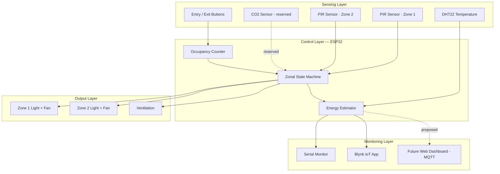
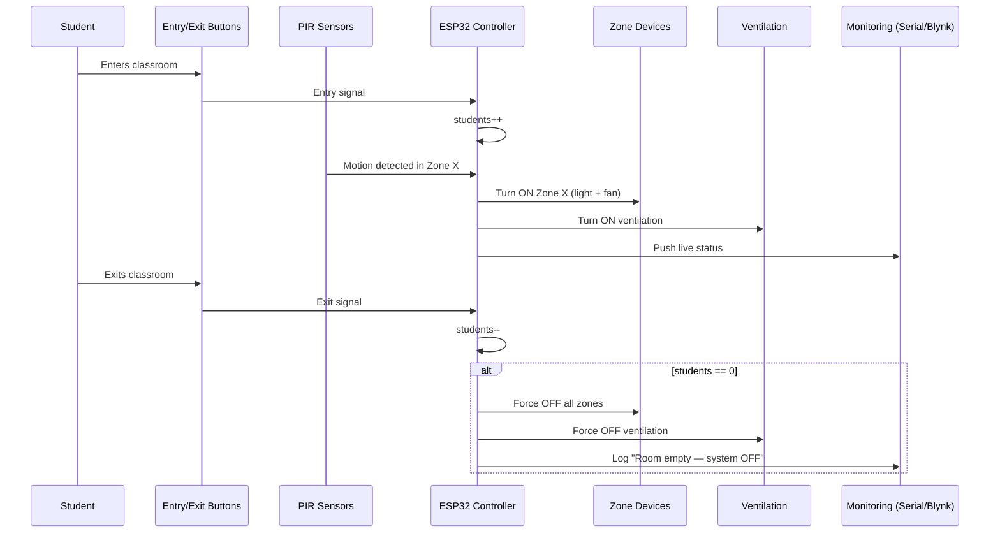

<div align="center">

# ⚡ Smart Zonal Energy Optimization System
### for Educational Institutions

**IoT-based classroom automation that turns lights and fans off in unused zones — automatically.**

[](https://www.espressif.com/en/products/socs/esp32)
[](https://www.arduino.cc/)
[](https://wokwi.com/)
[](https://blynk.io/)
[](https://arundhathismartenergyclassroom.netlify.app/)
[](#-license)


**[🌐 Live Dashboard Preview](https://arundhathismartenergyclassroom.netlify.app/) · [🧪 Wokwi Simulation](https://wokwi.com/projects/457846440077390849) · [📖 Documentation](#-table-of-contents)**

</div>

<p align="center">
  
</p>

> **Note**
> This repository is developed and maintained as an academic engineering project. It contains a **working ESP32 prototype** (validated in circuit and in the Wokwi simulator) plus a **proposed future web dashboard** that previews how a full institutional rollout would look and feel.

---

## 📑 Table of Contents

1. [Project Overview](#-project-overview)
2. [Problem Statement](#-problem-statement)
3. [Proposed Solution](#-proposed-solution)
4. [Objectives](#-objectives)
5. [Key Features](#-key-features)
6. [Technology Stack](#-technology-stack)
7. [Hardware Components](#-hardware-components)
8. [Software Components](#-software-components)
9. [IoT Integration — Blynk](#-iot-integration--blynk)
10. [Future Web Dashboard (Proposed)](#-future-web-dashboard-proposed-future-implementation)
11. [System Architecture](#-system-architecture)
12. [Workflow](#-workflow)
13. [Working Principle](#-working-principle)
14. [Control Algorithm](#-control-algorithm)
15. [Energy Monitoring Logic](#-energy-monitoring-logic)
16. [Repository Structure](#-repository-structure)
17. [Screenshots](#-screenshots)
18. [Demo Videos](#-demo-videos)
19. [Live Website](#-live-website)
20. [Installation Guide](#-installation-guide)
21. [Running in Wokwi](#-running-in-wokwi)
22. [Configuring Blynk](#-configuring-blynk)
23. [Results](#-results)
24. [Advantages](#-advantages)
25. [Limitations](#-limitations)
26. [Future Enhancements](#-future-enhancements)
27. [Challenges Faced](#-challenges-faced)
28. [Lessons Learned](#-lessons-learned)
29. [Applications](#-applications)
30. [Sustainable Development Goals](#-sustainable-development-goals)
31. [References](#-references)
32. [License](#-license)
33. [Author](#-author)

---

## 🧭 Project Overview

The **Smart Zonal Energy Optimization System** is an ESP32-based classroom automation prototype that reduces electricity wastage by controlling lights and fans **per zone**, based on real occupancy — instead of the usual "all on, all off" classroom switchboard.

The project has two layers:

| Layer | Status | Description |
|---|---|---|
| 🔌 **Embedded Prototype** | ✅ Built & simulated | ESP32 firmware + sensors, validated on breadboard and in Wokwi, with live telemetry pushed to a Blynk dashboard |
| 🖥️ **Web Dashboard** | 🧪 Proposed / Future | A browser-based MQTT dashboard concept, hosted as a live UI preview on Netlify, designed for the next phase of the project |

> **Tip**
> Everything under [Hardware Components](#-hardware-components) and [Control Algorithm](#-control-algorithm) reflects the actual firmware in [`sketch.ino`](./sketch.ino). Anything marked **Proposed** is a design target, not a shipped feature.

---

## ❗ Problem Statement

In most classrooms across Indian educational institutions:

- 💡 Lights and fans stay **ON for the entire class period**, regardless of how many zones of the room are actually occupied.
- 🖐️ Switching is **manual**, and negligence means devices are often left running after students leave.
- 📉 There is **no feedback loop** between occupancy and power consumption — energy usage is decided by habit, not by data.
- 💸 The result is a **recurring, avoidable operational cost** for the institution, multiplied across every classroom, every day.

Electricity is treated as a fixed cost, when in practice a large share of it is wasted on empty seats and empty zones.

---

## 💡 Proposed Solution

Instead of one master switch per room, the system divides a classroom into **zones** and treats each zone's power state as a function of *local* occupancy:

- Entry/exit events maintain a live **student count** for the room.
- Motion sensors placed per zone decide **which zone's lights and fan should be active**.
- The moment the room empties (count reaches zero), **every zone shuts down automatically** — no one has to remember to flip a switch.
- Environmental sensors (temperature, and in the full architecture, CO₂/sound/door state) add context so the system reacts to *actual presence*, not just a single noisy sensor reading.

This turns energy-saving from a "please remember" policy into a **default behavior of the room**.

---

## 🎯 Objectives

- ✅ Automatically detect classroom occupancy without cameras (privacy-friendly).
- ✅ Control lights and fans **independently per zone**, not per room.
- ✅ Guarantee automatic shutdown the instant a room becomes empty.
- ✅ Provide a live, remotely-accessible view of occupancy, temperature, and power draw.
- ✅ Build a design that is affordable, non-invasive (no rewiring of existing circuits), and scalable to multiple classrooms.

---

## ✨ Key Features

| Feature | Description | Status |
|---|---|---|
| 🧮 Occupancy Counting | Entry/exit buttons increment/decrement a live student counter | ✅ Implemented |
| 🗺️ Zonal Motion Detection | Independent PIR sensors per zone drive independent zone states | ✅ Implemented |
| 🌬️ Motion-Linked Ventilation | Ventilation activates whenever motion is detected in either zone | ✅ Implemented |
| 🔌 Auto Shutdown | All zones and ventilation force OFF when occupancy hits zero | ✅ Implemented |
| 🌡️ Environmental Sensing | DHT22 temperature logging; CO₂ analog channel available for future validation logic | ✅ Implemented (temperature) / 🧪 CO₂ reserved |
| 📱 Remote Monitoring | Live values pushed to a Blynk IoT dashboard during simulation | ✅ Implemented |
| ⚡ Energy Estimation | Real-time power draw and cumulative Wh energy consumption logged to Serial | ✅ Implemented |
| 🌐 Web Energy Dashboard | MQTT-driven browser dashboard with live gauges, zone cards, and sparklines | 🧪 Proposed Future Implementation |
| 🛰️ Multi-Sensor Validation | CO₂ trend + sound + door-reed sensor fusion to prevent false shutdowns | 🧪 Proposed Future Implementation |
| 🏫 Multi-Classroom Rollout | Central dashboard aggregating multiple ESP32 nodes across a campus | 🧪 Proposed Future Implementation |

---

## 🛠️ Technology Stack

<div align="center">

**Hardware**


**Software**


**IoT & Deployment**


</div>

| Category | Technology | Purpose |
|---|---|---|
| Microcontroller | ESP32 | Central controller for sensors, relays, and connectivity |
| Firmware Language | C++ (Arduino framework) | Sensor reads, zone logic, energy calculations |
| Simulation | Wokwi | Hardware-free circuit validation before physical deployment |
| Sensor Library | DHT.h | Temperature acquisition from the DHT22 |
| IoT Platform | Blynk | Remote telemetry and monitoring during simulation |
| Dashboard (proposed) | HTML5, CSS3, JavaScript, MQTT.js | Live browser-based energy dashboard for the next phase |
| Hosting | Netlify | Public preview of the proposed dashboard UI |

---

## 🔩 Hardware Components

| Component | Quantity | Role |
|---|---|---|
| ESP32 Dev Board | 1 | Main controller |
| PIR Motion Sensor | 2 | Zone 1 / Zone 2 motion detection |
| Push Button (Entry) | 1 | Increments occupancy count |
| Push Button (Exit) | 1 | Decrements occupancy count |
| DHT22 Sensor | 1 | Classroom temperature |
| Red LED ×2 | 2 | Represents Zone 1 / Zone 2 **lights** |
| Blue LED ×2 | 2 | Represents Zone 1 / Zone 2 **fans** |
| Yellow LED ×1 | 1 | Represents the **ventilation indicator** |
| Breadboard | 1 | Prototyping platform |
| 220 Ω Resistors | as needed | Current-limiting for LEDs |
| Analog CO₂ input | 1 | Reserved input channel for future occupancy-validation logic |

<details>
<summary><strong>📍 Pin Mapping (from <code>sketch.ino</code>)</strong></summary>

| Signal | GPIO |
|---|---|
| PIR1 (Zone 1) | 14 |
| PIR2 (Zone 2) | 27 |
| LIGHT1 | 18 |
| FAN1 | 19 |
| LIGHT2 | 23 |
| FAN2 | 25 |
| ENTRY_BUTTON | 32 |
| EXIT_BUTTON | 33 |
| VENTILATION | 26 |
| VENT_INDICATOR | 13 |
| DHTPIN (DHT22) | 4 |
| CO2PIN (analog) | 34 |

</details>

> In the fully proposed architecture (see [System Architecture](#-system-architecture)), these sensors are complemented by **dual IR beam sensors** for directional entry/exit counting, a **sound sensor**, and a **door reed switch** — used to cross-validate occupancy and avoid false shutdowns. These are design-stage additions and are **not present in the current prototype wiring**.

---

## 💻 Software Components

| Component | Description |
|---|---|
| `sketch.ino` | ESP32 firmware — occupancy counting, zonal control, ventilation logic, and energy estimation, printed live over Serial |
| Arduino IDE | Used to write, compile, and flash the firmware |
| Wokwi | Simulates the full circuit (ESP32 + sensors + LEDs) without physical hardware |
| Blynk App | Consumes telemetry from the simulated/physical device for remote viewing |
| `smart_classroom_dashboard.html` | Standalone, MQTT-driven dashboard — **proposed future implementation**, not wired to the current firmware |
| `flowchart.html` | Animated visual flowchart explaining the occupancy → zone → shutdown logic |

---

## 📡 IoT Integration — Blynk

During the Wokwi simulation phase, the project streams live sensor and state data to a **Blynk IoT dashboard**, giving a mobile/web view of the classroom without being physically present:

- Occupancy count and temperature readings
- Per-zone ON/OFF status
- Ventilation state

This provides the remote-monitoring layer for the current prototype, and validates the communication pattern that a future, production-grade deployment would extend to full cloud logging and multi-classroom aggregation.

> **Note**
> Blynk connectivity has been demonstrated in the Wokwi simulation environment for this project phase. See [Configuring Blynk](#-configuring-blynk) for setup steps.

---

## 🌐 Future Web Dashboard (Proposed Future Implementation)

> **Warning**
> The HTML/CSS/JS dashboard in this repository (`smart_classroom_dashboard.html`) is a **design preview of a future implementation**. It is **not currently wired to live classroom hardware** — the current firmware communicates over Serial and Blynk, not MQTT. The dashboard ships with a **demo-data mode** so its UI/UX can be evaluated independently of a live deployment, and it also includes an MQTT client (HiveMQ-compatible) that a future firmware revision could publish to.

**Planned dashboard sections:**

| Section | What it will show |
|---|---|
| Occupancy Card | Live student count and room status |
| Temperature Card | DHT22 readings with a rolling sparkline |
| Total Power Card | Aggregate power draw across all zones |
| Zone Panels | Per-zone light/fan state with a live power bar |
| Ventilation Panel | Motion-linked ventilation status |
| Voltage / Current Gauges | Circular gauges for bus voltage and current draw |
| Power History | Rolling sparkline of total power over time |
| MQTT Log | Raw topic/message stream for debugging and transparency |

It is hosted as a **live UI preview** on Netlify: **[arundhathismartenergyclassroom.netlify.app](https://arundhathismartenergyclassroom.netlify.app/)** — this link shows the *interface concept*, not a live institutional deployment.

---

## 🏗️ System Architecture



**Full proposed sensor architecture** (per the project's technology-architecture design, beyond the current prototype):

| Layer | Sensor | Purpose |
|---|---|---|
| Counting | Dual IR Beam | Directional entry/exit counting |
| Zonal | PIR ×N | Per-zone motion detection |
| Validation | CO₂ Sensor | Confirms sustained presence |
| Validation | Sound Sensor | Detects low-motion activity (e.g. seated work) |
| Sync | Door Reed Switch | Synchronizes entry/exit events |
| Output | Relay Modules | Switches real light/fan circuits |

---

## 🔄 Workflow



For a visual, animated version of this flow, see [`flowchart.html`](./flowchart.html).

---

## ⚙️ Working Principle

1. **Entry/Exit Tracking** — Push buttons simulate IR beam events; each entry increments and each exit decrements the occupancy counter.
2. **Zonal Motion Detection** — Each PIR sensor independently marks its zone as active when motion is detected.
3. **Selective Activation** — Only zones with confirmed motion turn their light and fan on; unoccupied zones stay off even if the room itself has students in it.
4. **Ventilation Coupling** — Ventilation activates whenever motion is present in *either* zone.
5. **Hard Shutoff** — The instant the occupancy counter reaches zero, both zones and ventilation are forced off — regardless of their last motion state.
6. **Continuous Telemetry** — Temperature, zone states, and power figures are logged every cycle over Serial (and mirrored to Blynk during simulation).

---

## 🧮 Control Algorithm

```text
LOOP every 500ms:
    IF entry_button pressed:      students += 1
    IF exit_button  pressed AND students > 0:  students -= 1

    read PIR1, PIR2
    read temperature (DHT22)
    read CO2 (reserved, monitored only)

    IF PIR1 == HIGH: zone1Active = true
    IF PIR2 == HIGH: zone2Active = true

    IF students == 0:
        zone1Active = false
        zone2Active = false

    apply zone1Active -> LIGHT1, FAN1
    apply zone2Active -> LIGHT2, FAN2

    ventilation = (PIR1 == HIGH) OR (PIR2 == HIGH)
    apply ventilation -> VENTILATION, VENT_INDICATOR

    compute currentPower, accumulate energyConsumed
    print status to Serial
```

This mirrors the real control flow implemented in [`sketch.ino`](./sketch.ino).

---

## 🔋 Energy Monitoring Logic

Each device is assigned a fixed power rating (Watts), and the firmware sums the active loads every cycle:

| Device | Power Rating |
|---|---|
| Light (per zone) | 15 W |
| Fan (per zone) | 60 W |
| Ventilation | 80 W |

```cpp
currentPower = 0;
if (zone1Active) currentPower += LIGHT_POWER + FAN_POWER;   // +75 W
if (zone2Active) currentPower += LIGHT_POWER + FAN_POWER;   // +75 W
if (ventilationOn) currentPower += VENT_POWER;               // +80 W

// Approximate energy in Watt-hours, accumulated every 0.5s cycle
energyConsumed += currentPower * (0.5 / 3600.0);
```

This gives a running estimate of instantaneous power draw (W) and cumulative energy consumption (Wh), both printed to the Serial monitor every cycle — the same figures the Blynk dashboard and the proposed web dashboard are designed to visualize.

---

## 📁 Repository Structure

```text
Smart-Zonal-Energy-Optimization/
├── sketch.ino                      # ESP32 firmware (occupancy, zonal control, energy logic)
├── smart_classroom_dashboard.html  # Proposed future web dashboard (MQTT-based)
├── flowchart.html                  # Animated visual flowchart of the control logic
├── README.md                       # Project documentation (this file)
└── docs/
    └── assets/                     # Screenshots, diagrams, and media (placeholders)
```

---

## 🖼️ Screenshots

<div align="center">

 | Wokwi Simulation |
|---|---|
|  |

| Blynk Dashboard |
|---|---|
|  |

| Future Web Dashboard |
|---|---|
|  |

| System Architecture | 
|---|---|
|  |

| Circuit Diagram |
|---|---|
|  |

</div>

---

## 🎥 Demo Videos

- 📹 **Prototype Demo (Breadboard)** — _placeholder link_
- 📹 **Wokwi + Blynk Live Simulation** — _placeholder link_
- 📹 **Future Dashboard Walkthrough** — _placeholder link_

---

## 🌍 Live Website

The proposed dashboard UI is live on Netlify:

**🔗 [https://arundhathismartenergyclassroom.netlify.app/](https://arundhathismartenergyclassroom.netlify.app/)**

> Reminder: this is a **UI preview running in demo mode by default**, not a connection to a physically deployed classroom.

---

## 🚀 Installation Guide

### Prerequisites
- [Arduino IDE](https://www.arduino.cc/en/software) (or Wokwi, no hardware required)
- ESP32 board package installed in Arduino IDE
- `DHT sensor library` (Adafruit) installed via Library Manager

### Steps

```bash
# 1. Clone the repository
git clone https://github.com/rarundhathi94/Smart-Zonal-Energy-Optimization.git
cd Smart-Zonal-Energy-Optimization

# 2. Open sketch.ino in Arduino IDE

# 3. Install dependencies via Library Manager:
#    - "DHT sensor library" by Adafruit
#    - "Adafruit Unified Sensor"

# 4. Select Board: ESP32 Dev Module

# 5. Select the correct COM port and click Upload
```

---

## 🧪 Running in Wokwi

1. Open the simulation: **[wokwi.com/projects/457846440077390849](https://wokwi.com/projects/457846440077390849)**
2. Click **▶ Start Simulation**.
3. Use the on-screen buttons to simulate entry/exit events.
4. Move the mouse near a PIR sensor to trigger motion in that zone.
5. Watch the LEDs (lights/fans/ventilation) and the Serial Monitor update in real time.

---

## 📲 Configuring Blynk

1. Create a free account at [blynk.io](https://blynk.io/) and start a new template/device.
2. Add datastreams for: occupancy count, temperature, Zone 1 state, Zone 2 state, ventilation state.
3. Copy your **Blynk Auth Token** into the firmware's Blynk configuration section.
4. Add the Blynk library via Arduino Library Manager (or Wokwi's built-in library support).
5. Run the simulation (or flash to hardware) and open the Blynk app to view live values.

---

## 📊 Results

- ✅ Zonal activation logic validated in both breadboard prototype and Wokwi simulation.
- ✅ Entry/exit occupancy tracking confirmed accurate across repeated test cycles.
- ✅ Automatic full shutdown verified the instant occupancy reaches zero.
- ✅ Live telemetry (occupancy, temperature, zone status) successfully streamed to Blynk during simulation.

---

## ✅ Advantages

- No camera involved — occupancy detection stays privacy-friendly.
- Zone-level granularity avoids "all-or-nothing" switching.
- Automatic shutdown removes reliance on human memory/discipline.
- Low-cost sensor set — no structural rewiring required for the prototype.
- Simulation-first workflow (Wokwi) lets the logic be validated before touching hardware.

## ⚠️ Limitations

- Current prototype relies on **PIR only** for zonal motion — no CO₂/sound/door cross-validation yet, so prolonged low-motion activity (e.g., silent reading) in a zone can theoretically be missed.
- Occupancy counter is **volatile** — a power cycle resets the count (no persistence yet).
- The web dashboard is a **UI concept**, not yet connected to live firmware telemetry.
- Real relay-driven load switching (mains lights/fans) has not yet been physically validated — only simulated at LED/logic level.

---

## 🔮 Future Enhancements

- 🧠 AI-based occupancy prediction from historical usage patterns
- ☁️ Cloud database for long-term energy analytics
- 📱 Dedicated mobile app for facility managers
- ☀️ Integration with renewable/solar energy systems
- 🛠️ Predictive maintenance alerts for sensors and relays
- 📑 Automated energy usage reports for institutions
- 🏫 Smart campus rollout across multiple buildings
- 🪞 Digital twin of the classroom for simulation-based planning
- 📈 Machine-learning-driven analytics on the web dashboard
- 🛰️ Multi-sensor fusion (CO₂ + sound + door reed) for false-shutdown prevention

---

## 🧗 Challenges Faced

- Balancing **responsiveness** (fast zone activation) against **false positives** from single-sensor PIR readings.
- Designing a shutdown rule that is aggressive enough to save energy but doesn't cut off a zone mid-use.
- Keeping the prototype **low-cost and non-invasive** while still leaving room to scale to a full multi-sensor architecture.
- Structuring energy estimation logic that stays simple on an embedded target but still produces meaningful Wh figures.

## 📘 Lessons Learned

- Zonal automation logic is best validated in simulation (Wokwi) before any hardware is soldered — it catches state-machine bugs early and for free.
- A single sensor type (PIR alone) is a good v1, but real institutional deployments need sensor fusion to avoid false shutdowns — this shaped the proposed multi-sensor architecture.
- Designing the dashboard and firmware as **decoupled layers** (Serial/Blynk now, MQTT later) made it possible to prototype the UI independently of the embedded timeline.

---

## 🏢 Applications

- Engineering colleges and universities
- Schools and coaching centers
- Corporate training rooms and seminar halls
- Smart campus energy management initiatives
- Any space with distinct, independently-usable zones

---

## 🌱 Sustainable Development Goals

| SDG | Contribution |
|---|---|
| **SDG 7** — Affordable and Clean Energy | Reduces avoidable electricity consumption in institutional buildings |
| **SDG 11** — Sustainable Cities and Communities | Supports smart, resource-efficient campus infrastructure |
| **SDG 12** — Responsible Consumption and Production | Encourages usage-based consumption instead of blanket operation |
| **SDG 13** — Climate Action | Lower electricity demand reduces the associated carbon footprint |


---

## 📚 References

- [ESP32 Official Documentation — Espressif](https://www.espressif.com/en/products/socs/esp32)
- [Wokwi Simulator](https://wokwi.com/)
- [Blynk IoT Platform](https://blynk.io/)
- [Adafruit DHT Sensor Library](https://github.com/adafruit/DHT-sensor-library)


---

## 📜 License

This project is licensed under the **MIT License** — see the [LICENSE](./LICENSE) file for details.

---

## 👩‍💻 Author

<div align="center">

**Built and maintained by [Arundhathi R](https://github.com/rarundhathi94)**

*Easwari Engineering College*

[](https://github.com/rarundhathi94)

If this project helped you, consider ⭐ starring the repository!

</div>
